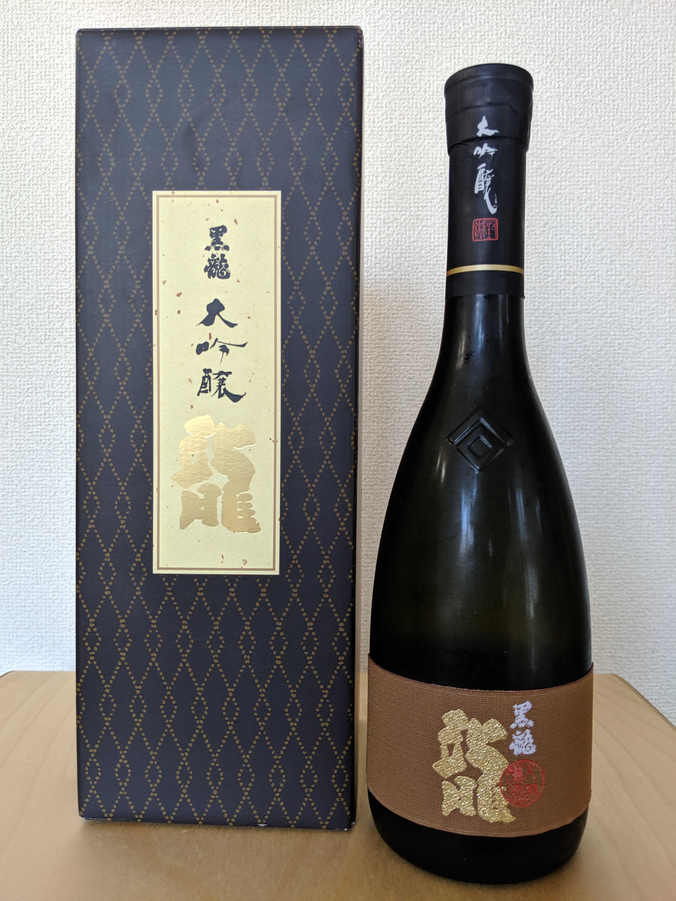
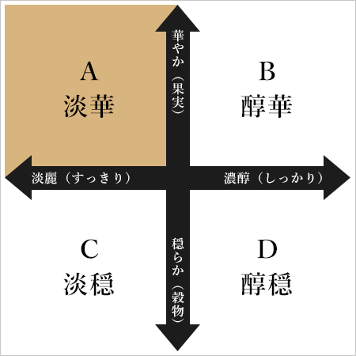

## 自分の好みを把握しておくといい

---

日本酒の味は一般的にこんな感じで表される

---

### 味を表す言葉

| | | |
|:-|:-:|-:|
|華やか| <=> | 穏やか|
| フルーティ | <=>  | 水のよう |
| 濃い | <=> | 淡い |
| 甘い | <=> | 辛い |
| 重い | <=> | 軽い |
| | | |

---

### 味以外の特徴

| | | |
|:-|:-|:-|
| 精米 | 杜氏 | 限定 |
| 酒蔵 | 値段 | 通年 |
| 銘柄 | 季節のお酒 | 料理に合う  |
| 酒米 | 純米 | |
| 酵母 | 仕込み | |
| 生酒 | 火入れ | |

---

### この辺で適当に自分にあう指標を選んで、

---

### 飲んだお酒をプロットしてみると好みの傾向わかる
### (かもしれない）

---

### 例: 黒龍 大吟醸 龍

---

## 味

- 後味スッキリ！

---

## 味以外

| | |
|:-|:-|
| 酒米 | 兵庫県産山田錦 |
| 精米 | 40％ |
| 区分 | 大吟醸 |
| 日本酒度 | +4.5 |
| 杜氏　| 畑山浩 |
| - | 通年販売 |
| 価格 | 720ml 4,000円（税抜） |

---

## 結論

---

最高!!

---

完
